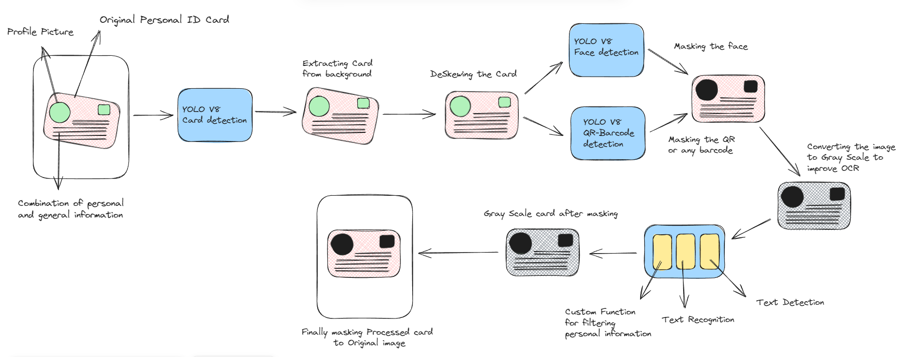
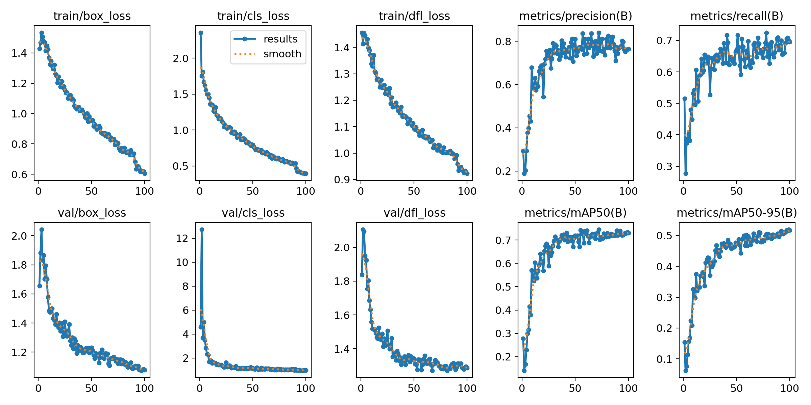

# CU_23RSG33CU_Personal_documentation_and_masking
SRIB-PRISM Program

# Introduction
Our aim is to provide a seamless solution for identifying personal documents and ensuring their confidentiality through effective masking techniques. In today's digital age, safeguarding personal information is paramount, and our application is designed to assist individuals and organizations in achieving this goal. Avoid scams effortlessly! Privacy Protection: Personal document masking and detection techniques help safeguard sensitive information by obscuring or redacting personally identifiable information (PII) such as names, addresses, and identification numbers.


Personal document masking and detection can also play a vital role in fraud prevention and security. By accurately identifying and verifying personal documents such as IDs, passports, and driver's licenses, businesses and institutions can authenticate the identity of individuals during various processes.

## Working Demo Video (Click Image below to watch)

⚠️To test the project you can go to `Infromation_Masking_Pipeline.ipynb` file.

[](https://youtu.be/ZktXpAhR_AA?si=82PExAj0G3ZI2vLz)

## Table of Contents
1. [Introduction](#introduction)
2. [Built With](#built-with)
3. [Our Approach](#our-approach)
4. [Getting Started](#getting-started)
   1. [Prerequisites](#prerequisites)
   2. [Project Setup](#project-setup)
5. [Literature Survey](#literature-survey)
   1. [What is object detection and how is it different from classification](#️what-is-object-detection-and-how-is-it-different-from-classification)
   2. [Why plain CNN is not used for object detection](#️why-plain-cnn-is-not-used-for-object-detection)
   3. [Alternative Approaches for Efficient Object Detection](#️alternative-approaches-for-efficient-object-detection)
   4. [Region Proposal networks](#️region-proposal-networks)
   5. [Understanding the selective search algorithm for region proposal](#️understanding-the-selective-search-algorithm-for-region-proposal)
   6. [Fast RCNN](#fast-rcnn)
   7. [How Fast R-CNN Works](#how-fast-r-cnn-works)
   8. [Faster RCNN](#faster-rcnn)
   9. [How Faster RCNN Works](#how-faster-rcnn-works)
   10. [Description about YOLO (You Only Look Once)](#description-about-yolo-you-only-look-once)
   11. [Overview of variants made from YOLO V1 TO V8](#overview-of-variants-made-from-yolo-v1-to-v8)
   12. [YOLO Model accuracy claimed by Ultralytics](#yolo-model-accuracy-claimed-by-ultralytics)


## Built With
To build this project, I've started by outlining the programming languages that form its foundation, followed by an in-depth exploration of the libraries incorporated. This deliberate documentation not only promotes transparency but also serves as a comprehensive reference to the technologies leveraged throughout the development journey. 

- Programming Language : Python
- Libraries: Tensorflow, keras, PIL, Ultralytics, OpenCV,paddleocr, NLTK, deskew, Pandas, Numpy, Matplotlib, Plotly, Streamlit

## Our Approach
The flowchart is illustrating the process of extracting and processing personal information from an original ID card image. The goal is to isolate and recognize key details like the card number, expiration date, and potentially other relevant fields.



Now, let's delve into the step-by-step process of how our application works.

* **Original Personal ID** Card: The process begins with an image of the **Original Personal ID** card, containing a profile picture and a combination of personal and general information.
* **YOLOv8 Card** Detection: The image is first processed using the **YOLOv8 Card** model for card detection. This step aims to accurately locate the card's boundaries within the image.
* **Extracting Card** from Background and De-skewing: Once the card is detected, it is **Extracting Card** from the background and de-skewed to ensure a rectangular and properly oriented card image for further processing.
* **YOLOv8 Face** Detection and Masking: The **YOLOv8 Face** model is again employed to detect and mask the face within the card image. This step helps protect personal privacy by obscuring facial features.
* **YOLOv8 QR/Barcode** Detection and Masking: The image is further scanned using **YOLOv8 QR/Barcode** to identify and mask any QR codes or barcodes present on the card. This step prevents unintended scanning of sensitive information.
* **Conversion to** Grayscale: The image is **Conversion to** grayscale to enhance the contrast between text and background, potentially improving the accuracy of subsequent OCR (Optical Character Recognition) steps.
* **Custom Function** for Filtering Personal Information: A **Custom Function** is applied to filter out non-essential information from the card image, focusing on the specific details required for the project.
* **Text Detection** and Recognition: The filtered image is then subjected to **Text Detection** and recognition processes to extract the relevant text data, such as card number, expiration date, and other designated fields.
* **Final Masking** and Integration: Finally, the processed card image with masked sensitive information is **Final Masking** and integrated back into the original image, preserving the overall context while protecting privacy.


To evaluate the effectiveness of our approach, we have included a visualization of the model's performance metrics. This section provides a graphical representation of the model's accuracy, precision, recall, and F1-score across different iterations. This visualization aims to give a clear understanding of how the model improves over time and its ability to accurately detect and mask personal documents.




<!-- GETTING STARTED -->
## Getting Started
This section provides guidance on configuring this project on your local machine and running the Streamlit application locally.
### Prerequisites
To run this project, ensure that your PC/Laptop has the following prerequisites:
- Python
- Integrated Development Environment (IDE) such as PyCharm or Visual Studio Code.

### Project Setup

To initialize this project on your local machine, kindly adhere to the outlined instructions provided herewith. By following these meticulously crafted steps, you will seamlessly configure the project environment for optimal functionality on your personal workstation. Your cooperation in adhering to these guidelines is greatly appreciated.

1. Create a new virtual environment by using the command
   ```sh
   conda create -p venv python=3.10 -y
   ```
2. Activate the newly created virtual environment
   ```sh
   conda activate venv/
   ```
3. Install all the required project dependencies by executing the provided command. Subsequent to running this command, the internal setup file will be invoked, facilitating the configuration of your project by identifying and installing the necessary packages.
   ```sh
   pip install -r requirements.txt
   ```
4. After successfully installing all essential dependencies, proceed to run Streamlit locally by executing the following command:
   ```sh
   streamlit run Strealmit/Home.py
   ```
<p align="right">(<a href="#readme-top">back to top</a>)</p>


# Literature Survey
This is the place for all the notes related to Object detection and the architectures related to the object detection. Basically we will talk about couple of architectures and understand the drawback of each of the architecture. The list of architectures we will be looking at are 
1. CNN
2. RCNN
3. Fast RCNN
4. Faster RCNN
5. YOLO
6. Short Overview of variations made from V1 to V8

### ▶️ What is object detection and how is it different from classification

From the birds eye view both object detection and classification are basically computer vision problems but the fundamental difference between the 2 is that in case of classification we are only focused towards assigning a predefined class label to the image whereas in case of object detection we first of all we try to find out the exact positioning of object in the image (Object localization) and then assigning a predefined class to that object in image.

<div align="center">
	
</div>


### ▶️ Why plain CNN is not used for object detection

As a matter of fact the CNN can be used for doing object detection but the thing is that they can only be used to detect single object only. In very very simple terms we simply need to pass the image having an object in it through the Conv and Pooling layers of CNN to extract features from it, and after that we need to adjust the overall architecture in such a way that it not only predicts the bounding box coordinates of the object, but also gives us the class probability.

<div align="center">
	
</div>


Now in order to make CNN detect more than 1 object in the image we need to use sliding window approach, where we will define a window of size w * h and we will move that window over the entire image and pass every window patch to the CNN for detection of bounding box and class probability. The 2 major drawback of this approach 
1. It is computationally very much expensive
2. There is a tradeoff between accuracy/speed and the size of the sliding window

### ▶️ Alternative Approaches for Efficient Object Detection:

- **Region Proposal Networks (RPNs):** There are architectures like R-CNN, Fast RCNN and Faster RCNN. RPNs are smaller networks that efficiently propose candidate regions likely to contain objects. The CNN then focuses its processing power on these promising regions instead of every possible window.
- **Single Shot Detectors (SSD) & You Only Look Once (YOLO):** These architectures aim to directly predict bounding boxes and class probabilities from a single image pass through the CNN. They achieve this through various techniques like feature pyramids and anchor boxes, avoiding the need for exhaustive sliding windows.

### ▶️ Region Proposal networks

Out of all region proposal networks R-CNN was the very first architecture which was built on top of CNN for doing object detection. The way this network works is that rather that doing exhaustive search over the entire image for doing object detection it uses a Selective Search algorithm on top of CNN to first propose some possible regions in the overall frame which have high probability of having some object. And then only the CNN is applied for these selected regions. 

<div align="center">
	
</div>


### ▶️ Understanding the selective search algorithm for region proposal

Selective search algorithm basically propose 2000 region proposals, let us take a look at the steps which are being followed for proposing the regions ⬇️

1. `Step 1 (Over segmentation)` → Performing over segmentation on the given image, where the segmented regions will actually hold low level features like color similarity.

    <div align="center">
	
   </div>
    
2. `Step 2 (Similarity-based Merging)` → After the over segmentation the merging of these regions is performed based on similarity like Color similarity, texture similarity and size similarity
    
3. `Step 3 (Hierarchical merging strategy)` → Selective Search doesn't simply merge all similar regions at once. Instead, it follows a hierarchical strategy.
    
    - It calculates the similarity between all pairs of adjacent regions.
    - The most similar pair of regions is then merged into a single larger region.
    - This process continues iteratively, merging the most similar regions based on the updated similarities after each merge.
        
      <div align="center">
      
      </div>
        
4. `Step 4 (Stopping criteria)` → The merging process stops when a certain stopping criterion is met. This criterion can be based on factors like:
    
    - Reaching a predefined number of regions.
    - Reaching a minimum region size (avoiding merging very small regions).

### ▶️ Fast RCNN
Fast R-CNN (Region-based Convolutional Neural Networks) is an object detection algorithm that builds on the original R-CNN (Region-based Convolutional Neural Networks). It is a single-stage training algorithm that improves the speed and accuracy of R-CNN and SPPnet for object detection.
Fast R-CNN was shown to achieve a mean Average Precision (mAP) of 66% on the PASCAL VOC 2012 dataset. The method trains deep detection network (VGG16) 9x faster than R-CNN and 3x faster than SPPnet. Fast R-CNN processes images at runtime in 0.3 seconds (excluding object proposal time).

### How Fast R-CNN Works

Fast R-CNN is experimented with three pre-trained ImageNet networks each with *5* max-pooling layers and *5-13* convolution layers There are some changes proposed in this pre-trained network, These changes are:

Each feature vector is then fed into a sequence of fully connected layers, which branch into two sibling output layers:

1. **Softmax probability estimates:** This layer produces probability estimates over K object classes and a "background" class.
2. **Bounding-box position refinements:** This layer outputs four numbers that encode refined bounding-box positions for each of the K object classes.


### ▶️ Faster RCNN
Faster R-CNN is a system for object detection in images. Faster R-CNN is composed of two modules: 
(1) a deep fully convolutional network that proposes regions of interest.
(2) a Fast R-CNN detector that uses the proposed regions.

**Prior to the development of Faster R-CNN, object detection systems relied on slow, computationally expensive region proposal methods like Selective Search and EdgeBoxes to hypothesize object locations**. Faster R-CNN introduces a Region Proposal Network (RPN) that shares full-image convolutional features with the Fast R-CNN detector, allowing for the computation of region proposals at a very low marginal cost.

### How Faster RCNN Works

- **Faster R-CNN takes an image as input and passes it to a convolutional neural network (CNN)**. The CNN generates a convolutional feature map.
- **A small network is slid over the convolutional feature map outputted by the CNN**. This small network is a n x n spatial window that maps each sliding window to a low-dimensional vector.
- **The low-dimensional vector of each sliding window is fed into two fully connected layers: a box-regression layer (reg) and a box-classification layer (cls)**.
- **The reg layer encodes the coordinates of *k* boxes, where *k* refers to the number of region proposals the network simultaneously predicts at each sliding-window location**.
- **The *k* proposals are parameterized relative to *k* reference boxes, called anchors**. Anchors are centered at the relevant sliding window, and each is associated with a scale and aspect ratio.
- **The cls layer outputs 2k scores that estimate the probability of each proposal containing an object versus not containing an object**.

Using this architecture, **Faster R-CNN achieves state-of-the-art object detection accuracy at a frame rate of 5–17 fps**.

### ▶️ YOLO (You Only Look Once)
**YOLO** (You Only Look Once) is a real-time, end-to-end object detection framework known for its speed and accuracy. Unlike earlier methods that relied on sliding windows or two-step processes, YOLO performs object detection with a single network pass. Instead of using separate classification and regression outputs like Fast R-CNN, YOLO simplifies the output to a straightforward regression-based prediction of detection results.  This combination of a single-pass approach and simplified output contributes to YOLO's speed advantage over previous object detectors.

YOLO's impact extends across diverse fields, including:

- **Autonomous Vehicles:** Enables rapid identification and tracking of objects such as vehicles, pedestrians, bicycles, and obstacles, crucial for safe navigation.
- **Robotics:** Facilitates object recognition and localization, enhancing the capabilities of robots in various tasks.
- **Video Surveillance:** Allows for real-time monitoring and analysis of video feeds, enabling swift detection of suspicious activities.
- **Agriculture:** Aids in the detection and classification of crops, pests, and diseases, contributing to precision agriculture techniques.
- **Medical Field:** Employed for tasks such as cancer detection, skin segmentation, and pill identification, improving diagnostic accuracy.

This list provides a glimpse into the wide-ranging applications of YOLO, highlighting its significance in various domains.

### ▶️ Short Overview of variations made from V1 to V8

**YOLOv1**

- Utilized a grid system, dividing the input image into a 7x7 grid, with each grid cell capable of predicting two bounding boxes.
- The output was a tensor with dimensions 7x7x30, assuming 20 object categories (C=20).
- The architecture included 24 convolutional layers and two fully-connected layers.
- Employed Leaky ReLU activations for all layers except the final layer, which utilized a linear activation function.
- Pre-trained on the ImageNet dataset at a 224x224 resolution, followed by fine-tuning on the PASCAL VOC datasets (2007 and 2012) at a 448x448 resolution.
- The loss function combined localization loss, confidence loss, and classification loss.

**YOLOv2**

- Introduced batch normalization for all convolutional layers.
- Implemented anchor boxes for bounding box prediction.
- Utilized k-means clustering to determine five optimal prior boxes, improving bounding box prediction accuracy.
- Transitioned to a fully convolutional architecture by eliminating dense layers.
- Introduced a passthrough layer to preserve fine-grained features by concatenating them with lower-resolution feature maps.
- Implemented multi-scale training, randomly adjusting input image sizes during training.

**YOLOv3**

- Introduced multi-scale predictions, enabling the detection of objects at three different scales.
- Replaced the softmax activation in the classification head with independent logistic classifiers and binary cross-entropy loss.
- Replaced the Darknet-19 backbone with the larger Darknet-53 backbone.
- Incorporated a modified Spatial Pyramid Pooling (SPP) block to enhance the receptive field.
- Utilized k-means clustering to determine three prior boxes, corresponding to the three prediction scales.

**YOLOv4**

- Implemented an enhanced architecture (CSPDarknet53-PANet-SPP) incorporating Cross-Stage Partial connections (CSP), Spatial Pyramid Pooling (SPP), and a modified Path Aggregation Network (PAN).
- Introduced the concept of "bag-of-freebies" (BoF) and "bag-of-specials" (BoS) to categorize architectural and training improvements.
- Integrated various BoFs, including mosaic augmentation, DropBlock regularization, CIoU loss, and Cross mini-batch normalization (CmBN).

**YOLOv5**

- Developed in PyTorch instead of Darknet.
- Introduced the AutoAnchor algorithm for automatically selecting anchor boxes based on the dataset.
- Utilized a modified CSPDarknet53 backbone, a Spatial Pyramid Pooling Fast (SPPF) layer, and a modified CSP-PAN neck.
- Incorporated various augmentations, including Mosaic, copy-paste, random affine, MixUp, HSV augmentation, and random horizontal flip.

**YOLOv6**

- Introduced a new backbone called EfficientRep based on RepVGG, utilizing higher parallelism.
- Employed a PAN neck enhanced with RepBlocks or CSPStackRep blocks.
- Utilized an efficient decoupled head.
- Implemented label assignment using the Task Alignment Learning (TAL) approach.
- Introduced a VariFocal Loss for classification and SIoU/GIoU loss for regression.
- Incorporated a self-distillation strategy and a quantization scheme for faster detection.

**YOLOv7**

- Introduced the Extended Efficient Layer Aggregation Network (E-ELAN) for enhanced feature extraction.
- Proposed a new model scaling strategy for concatenation-based architectures.
- Used RepConvN, a modified version of RepConv without the identity connection.
- Implemented planned re-parameterized convolution, coarse and fine label assignment for auxiliary and lead heads, respectively, batch normalization in conv-bn-activation, implicit knowledge, and exponential moving average for the final inference model.

**YOLOv8**

- Features a modified CSPDarknet53 backbone with C2f modules.
- Employs an anchor-free model with a decoupled head for improved accuracy.
- Utilizes CIoU and DFL loss functions for bounding box regression and binary cross-entropy for classification.
- Introduced the YOLOv8-Seg model for semantic segmentation, incorporating a CSPDarknet53 backbone, C2f modules, and two segmentation heads.

### YOLO Model Accuracy and Advancements

| Version       | Date | Anchor | Framework | Backbone          | AP (%) | Key Advancements                                                                                                                                                            |
|---------------|------|--------|-----------|-------------------|--------|----------------------------------------------------------------------------------------------------------------------------------------------------------------------------|
| YOLO          | 2015 | No     | Darknet   | Darknet24         | 63.4   | First real-time end-to-end object detection; unifies bounding box detection in a single pass.                                                                               |
| YOLOv2        | 2016 | Yes    | Darknet   | Darknet24         | 78.6   | Batch normalization, high-resolution classifier, anchor boxes, direct location prediction, finer-grained features, multi-scale training.                                     |
| YOLOv3        | 2018 | Yes    | Darknet   | Darknet53         | 33.0   | Logistic regression for objectness score, binary cross-entropy for multi-label classification, Darknet-53 backbone, Spatial Pyramid Pooling (SPP), multi-scale predictions. |
| YOLOv4        | 2020 | Yes    | Darknet   | CSPDarknet53      | 43.5   | Bag-of-Freebies (BoF) and Bag-of-Specials (BoS), CSPDarknet53-PANet-SPP architecture, Mish activation, Cross-Stage Partial connections (CSP), spatial pyramid pooling (SPP), Path Aggregation Network (PAN), Self-adversarial Training (SAT). |
| YOLOv5        | 2020 | Yes    | Pytorch   | YOLOv5CSPDarknet  | 55.8   | Developed in Pytorch, AutoAnchor for anchor box adjustment, modified CSPDarknet53 backbone, Mosaic augmentation, improved grid sensitivity.                                  |
| Scaled-YOLOv4 | 2021 | Yes    | Pytorch   | CSPDarknet        | 56.0   | Introduced scaling techniques for larger (YOLOv4-large) and smaller (YOLOv4-tiny) models.                                                                                   |
| YOLOR         | 2021 | Yes    | Pytorch   | CSPDarknet        | 55.4   | Multi-task learning approach with a single model for various tasks, encoding implicit knowledge.                                                                            |
| YOLOX         | 2021 | No     | Pytorch   | YOLOXCSPDarknet   | 51.2   | Anchor-free architecture, multi-positives, decoupled head, advanced label assignment (SimOTA), strong augmentations.                                                        |
| YOLOv6        | 2022 | No     | Pytorch   | EfficientRep      | 52.5   | EfficientRep backbone based on RepVGG, PAN neck with RepBlocks or CSPStackRep Blocks, efficient decoupled head, Task Alignment Learning (TAL), new loss functions, self-distillation strategy, quantization scheme. |
| YOLOv7        | 2022 | No     | Pytorch   | YOLOv7Backbone    | 56.8   | Extended efficient layer aggregation network (E-ELAN), model scaling for concatenation-based models, planned re-parameterized convolution, implicit knowledge, exponential moving average for inference. |
| DAMO-YOLO     | 2022 | No     | Pytorch   | MAE-NAS           | 50.0   | Neural Architecture Search (NAS) using MAE-NAS, Efficient-RepGFPN neck, ZeroHead, AlignedOTA label assignment, knowledge distillation with Align Module and Channel-wise Dynamic Temperature. |
| YOLOv8        | 2023 | No     | Pytorch   | YOLOv8CSPDarknet  | 53.9   | C2f module in the backbone, anchor-free model with a decoupled head, CIoU and DFL loss functions, YOLOv8-Seg model for semantic segmentation.                                |
| YOLO-NAS      | 2023 | No     | Pytorch   | NAS               | 52.2   | Quantization aware modules (QSP, QCI), AutoNAC for architecture design, hybrid quantization, pre-training with automatically labeled data and self-distillation.             |
